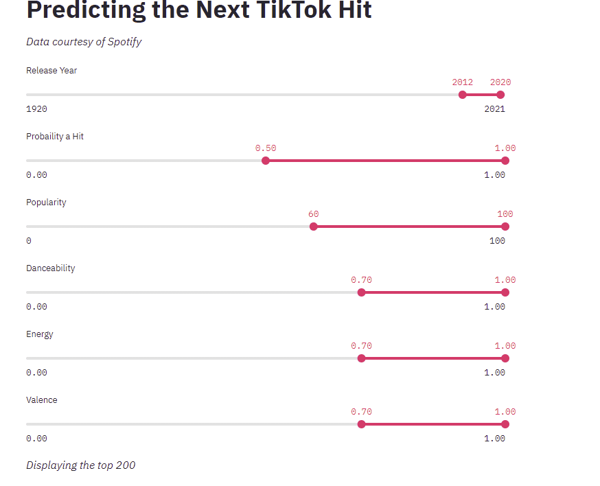

# Predicting the Next Hit Song on TikTok
## Motivation

- TikTok has rapidly become one of the most popular social media platforms and the simplicity of the app allows anyone the possibility of becoming a popular "creator" (TikTok slang for influencer) on the app.

- The app mostly consists of dance routines to songs such as,  the "Renegade" by artist K  Camp and "Savage" by Megan Thee Stallion.

- TikTok stars like Charlie D'Amelio (111M followers) and Addison Rae (78M) have becoming full blown celebrities.  However, TikTok stars no longer have the same security to stay on top as the celebrities of "old" did. 

- Rachel Monroe wrote this well in her piece featured in the *Atlantic*

  
“In the old model of celebrity, stars were propped up by studios and agencies with a stake in their enduring appeal. TikTok’s young stars have grown up in a world where fame can arrive in an instant, but also disappear overnight.

## Objective

- **Goal**: Predict whether a song will be a hit on TikTok 
- **Product**: Create a web application that recommends songs that may be hits on TikTok.  This will help stars stay ahead of the curve and product top-notch content.

## Data and Tools

- **Data**: 
  - *Top TikTok* Songs: Utilized [Chartmetric's](https://www.chartmetric.com/) weekly and daily TikTok charts to select top songs
  - *Song Features*: Extracted song features from the Spotify API
- **Tools**
  - Numpy, Pandas, Selenium, Sci-kit learn, Imbalanced Learn, Streamlit, Seaborn, Matplotlib, Tableau, XG Boost

# Labels and Features

**Labels:**

- Background:
  - Songs are measured how successful they are on TikTok by the number of video counts they have (the number of videos made with this song as the background music)
  - Chartmetric ranks the top songs on two measures: 1) Top daily songs by video count 2) Top 7 day trailing songs by video count
- Labels were broken out into two groups:
  - *Hit:* if a song every breaks the top 50 for daily video counts or 7 day trailing video counts
  - *Not a Hit:* if a song never breaks the top 50 for daily video counts or 7 day trailing video counts

**Features:** 

- *Song Features*: Danceability, Energy, Key, Mode, Speechiness, Acousticness, Liveness, Valence, Loudness, Tempo, Instrumentalness
- *Metadata*: Year Released, Artists

## Models

- Trained and optimized various models including: 
  - Logistic Regression
  - Naïve Bayes 
  - K Nearest Neighbors
  - Decision Trees (Random Forest, Balanced Random Forest, Balanced Bagging Classifier)
  - XG Boost, Neural Network 

## Results

- Selected the top model based on F1 score with the goal of reducing false negatives and false positives
- Balanced Random Forest was the top model with an F1 score of 80%

**Confusion Matrix**

**Feature Importance** 

## Web Application

- [Check out the live website here](https://share.streamlit.io/andrewdouglassmith1/tiktok_hit_predictor/main/Streamlit/streamlit_app3.py)

